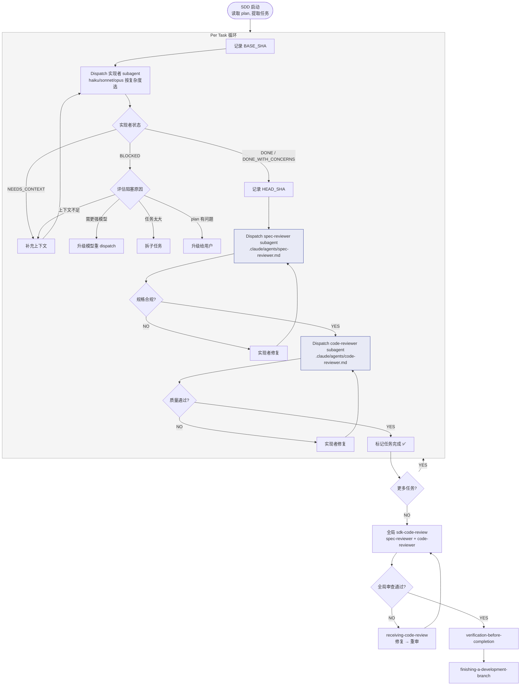
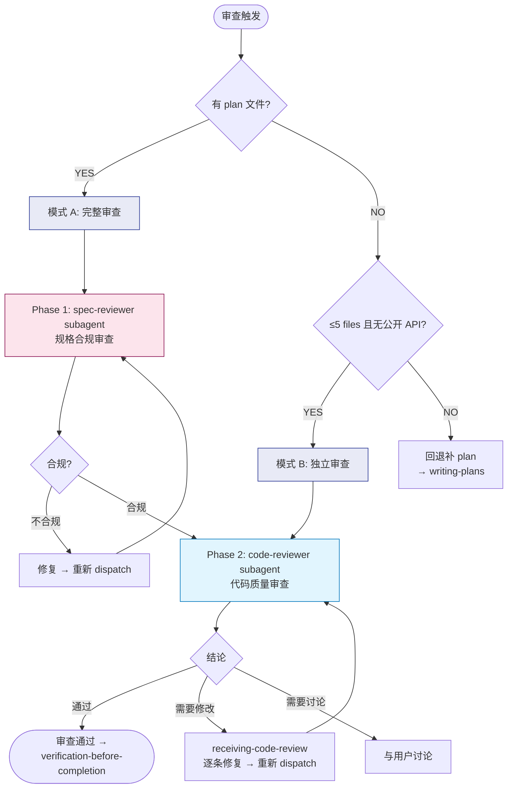

# Agents & Skills 流转结构图

> 基于当前 `.claude/agents/` 和 `.agents/skills/` 的实际内容分析。最后更新：2026-04-16。

## 1. 整体架构概览

```
┌─────────────────────────────────────────────────────────────────────┐
│                        SESSION START                                │
│  .claude/hooks/session-start.sh                                     │
│  → 注入 using-growingio-sdk-skills meta-skill 全文到会话上下文       │
└──────────────────────────────┬──────────────────────────────────────┘
                               │
                               ▼
┌─────────────────────────────────────────────────────────────────────┐
│               MAIN CONTROLLER (主控制器 Agent)                       │
│  Persona: .claude/agents/engineering-harmonyos-sdk-engineer.md      │
│                                                                     │
│  职责：理解用户意图 → 路由到正确 skill → 调度 subagent → 协调全流程   │
│  规则：不直接写代码（大型任务），通过 subagent 隔离上下文              │
└──────────────────────────────┬──────────────────────────────────────┘
                               │
                               ▼
                 ┌─────────────────────────┐
                 │ using-growingio-sdk-skills │
                 │     (Meta-Skill 入口门)    │
                 │  • Planning Gate (硬门)    │
                 │  • Workflow Routing        │
                 │  • Skill Checklist→Task    │
                 └─────────────┬─────────────┘
                               │
                        Workflow Routing
                           (见下图)
```

## 2. 主流程（Workflow Routing）

```mermaid
flowchart TD
    START([用户请求]) --> META[using-growingio-sdk-skills<br/>入口门 — 已由 Hook 注入]

    META --> INTENT{理解意图}

    INTENT -->|需求模糊/无规格| BS[🧠 brainstorming<br/>一次一问收敛规格]
    INTENT -->|需求明确| DOCS

    BS --> SPEC_FILE[产出 docs/specs/*.md]
    SPEC_FILE --> USER_APPROVE_SPEC{用户审阅规格}
    USER_APPROVE_SPEC -->|拒绝/修改| BS
    USER_APPROVE_SPEC -->|确认| DOCS

    DOCS[读领域文档<br/>sdk-doc-routing.md<br/>sdk-critical-rules.md]
    DOCS --> GATE{Planning Gate<br/>≥3 files OR 公开 API?}

    GATE -->|YES| WP[📋 writing-plans<br/>产出 docs/plans/*.md]
    GATE -->|NO| IMPL_DIRECT[直接实施<br/>单一职责 edits]

    WP --> PDR[📝 plan-document-review<br/>dispatch general-purpose subagent<br/>审查 plan 质量]

    PDR --> PDR_RESULT{plan 审查结论}
    PDR_RESULT -->|需要修改| WP
    PDR_RESULT -->|2轮仍有 Critical| ESCALATE[升级给用户讨论]
    PDR_RESULT -->|通过| USER_CONFIRM{用户确认 plan}

    USER_CONFIRM -->|拒绝/修改| WP
    USER_CONFIRM -->|确认| SDD_GATE{任务 ≥3 且大部分独立?}

    SDD_GATE -->|YES| SDD[🤖 subagent-driven-development<br/>控制器不写代码]
    SDD_GATE -->|NO| IMPL_PLAN[直接实施<br/>按 plan 逐步 edit]

    IMPL_DIRECT --> VERIFY
    IMPL_PLAN --> VERIFY
    SDD --> VERIFY

    VERIFY[✅ verification-before-completion<br/>跑真实构建/测试命令<br/>读完整输出]

    VERIFY --> VERIFY_RESULT{验证结论}
    VERIFY_RESULT -->|失败| DEBUG[🔧 systematic-debugging<br/>四阶段方法]
    DEBUG --> VERIFY
    VERIFY_RESULT -->|通过| REVIEW_GATE{审查模式选择}

    REVIEW_GATE -->|有 plan| REVIEW_A[sdk-code-review 模式 A<br/>spec-reviewer → code-reviewer]
    REVIEW_GATE -->|无 plan + ≤5 files| REVIEW_B[sdk-code-review 模式 B<br/>仅 code-reviewer]
    REVIEW_GATE -->|琐碎改动| FINISH

    REVIEW_A --> REVIEW_RESULT
    REVIEW_B --> REVIEW_RESULT

    REVIEW_RESULT{审查结论}
    REVIEW_RESULT -->|通过| FINISH
    REVIEW_RESULT -->|需修改| RCR[receiving-code-review<br/>STOP-ASK → 修复 → 重派 reviewer]
    RCR --> VERIFY

    FINISH[🏁 finishing-a-development-branch<br/>五步收尾]
    FINISH --> IS_RELEASE{发版分支?<br/>version 字段变更?}

    IS_RELEASE -->|YES| RELEASE_SIDE
    IS_RELEASE -->|NO| BRANCH_END

    subgraph RELEASE_SIDE [Release 侧流]
        JIRA[jira-ticket<br/>创建发版 Jira] --> OHPM[ohpm-publish<br/>发布 HAR 到 OHPM]
        OHPM --> TAG[git tag<br/>按 git-conventions 命名]
    end

    BRANCH_END[git-conventions 规范<br/>commit / PR / 分支名<br/>→ Done ✅]
    RELEASE_SIDE --> BRANCH_END

    style META fill:#e1f5fe,stroke:#0277bd
    style GATE fill:#fff3e0,stroke:#ef6c00
    style SDD fill:#f3e5f5,stroke:#7b1fa2
    style VERIFY fill:#e8f5e9,stroke:#2e7d32
    style DEBUG fill:#fce4ec,stroke:#c62828
    style FINISH fill:#e0f2f1,stroke:#00695c
    style RELEASE_SIDE fill:#fff8e1,stroke:#f9a825
```



## 3. Subagent-Driven Development 内部流程



## 4. SDK Code Review 详细流程



## 5. 旁路 Skills（实施期可随时插入）

```
实施过程中的任意时刻：
  │
  ├── 改核心模块（事件管道/存储/网络）
  │     → test-driven-development (Red-Green-Refactor)
  │
  ├── 写/审 .ets / .ts 文件
  │     → growingio-arkts-coding-style (ArkTS 编码规范)
  │
  ├── 任何 build/test/runtime 失败
  │     → systematic-debugging (四阶段方法)
  │     → 修完后回到失败前的上一步
  │
  └── 修改 .agents/skills/*/SKILL.md
        → writing-skills (Meta 侧流, 与主流程正交)
```

## 6. 组件清单

### Hooks

| Hook | 触发时机 | 作用 |
|------|---------|------|
| `session-start.sh` | 每次会话开始 | 注入 meta-skill 全文到上下文 |

### Agents

| Agent | 文件 | 角色 | 调度者 |
|-------|------|------|--------|
| **Main Controller** | `engineering-harmonyos-sdk-engineer.md` | 主控制器，理解意图、路由 skill、调度 subagent | — (入口) |
| **Code Reviewer** | `code-reviewer.md` | 代码质量、规范、安全性审查 | `sdk-code-review` / SDD |
| **Spec Reviewer** | `spec-reviewer.md` | 规格合规审查（实现 vs 规划） | `sdk-code-review` / SDD |
| **Plan Reviewer** | _(inline prompt in `plan-document-review`)_ | 审查 plan 文档完整性 | `plan-document-review` |
| **Implementer** | _(inline prompt in SDD)_ | 执行单个 plan 任务 | SDD |

### Skills

| 类别 | Skill | Type | Discipline | 触发条件 |
|------|-------|------|------------|---------|
| **入口** | `using-growingio-sdk-skills` | Technique | Rigid | 每次交互（Hook 自动注入） |
| **探索** | `brainstorming` | Pattern | Flexible | 需求模糊/范围不清 |
| **规划** | `writing-plans` | Technique | Rigid | Planning Gate 触发 |
| **规划审查** | `plan-document-review` | Technique | Rigid | plan 产出后 |
| **实施调度** | `subagent-driven-development` | Technique | Rigid | ≥3 独立任务 |
| **验证** | `verification-before-completion` | Technique | Rigid | 声明完成前 |
| **代码审查** | `sdk-code-review` | Technique | Rigid | 实施完成后 |
| **反馈处理** | `receiving-code-review` | Technique | Rigid | 收到审查反馈 |
| **收尾** | `finishing-a-development-branch` | Technique | Rigid | 验证+审查通过后 |
| **调试** | `systematic-debugging` | Technique | Rigid | 任何失败 |
| **TDD** | `test-driven-development` | Technique | Rigid | 核心路径实现 |
| **编码规范** | `growingio-arkts-coding-style` | Reference | Flexible | 写/审 .ets/.ts |
| **Git 规范** | `git-conventions` | Reference | Flexible | commit/PR/branch/tag |
| **发版 Jira** | `jira-ticket` | Reference | Flexible | 发版分支 |
| **OHPM 发布** | `ohpm-publish` | Technique | Rigid | 发版分支 |
| **Skill 编写** | `writing-skills` | Technique | Rigid | 修改 SKILL.md |

### Skill Type 说明

两个正交维度（定义见 `writing-skills`）：

**本质分类（这个 skill 是什么）：**

| Type | 含义 | 示例 |
|------|------|------|
| **Technique** | 具体方法，有步骤可循 | `test-driven-development`, `systematic-debugging` |
| **Pattern** | 思维模型，指导如何思考 | `brainstorming` |
| **Reference** | 查询式，结构化条目 | `git-conventions`, `growingio-arkts-coding-style` |

**执行纪律标签（这个 skill 怎么执行）：**

| Discipline | 含义 | 要求 |
|---|---|---|
| **Rigid** | 必须严格遵守，不得适配 | 必须带 Rationalizations 表 + Red Flags |
| **Flexible** | 原则可按场景取舍 | 不需 Rationalizations |

## 7. 信息流向总结

```
Hook 注入
    │
    ▼
Meta-Skill (入口门 + 路由)
    │
    ├─→ 探索阶段: brainstorming → specs/
    │
    ├─→ 规划阶段: writing-plans → plan-document-review → 用户确认
    │
    ├─→ 实施阶段: SDD (subagent 隔离) 或 直接实施
    │        │
    │        ├── 旁路: TDD / coding-style / systematic-debugging
    │        │
    │        └── Subagents: implementer → spec-reviewer → code-reviewer
    │
    ├─→ 验证阶段: verification-before-completion ←→ systematic-debugging
    │
    ├─→ 审查阶段: sdk-code-review (spec-reviewer + code-reviewer)
    │        │
    │        └── receiving-code-review (反馈处理 loop-back)
    │
    └─→ 收尾阶段: finishing-a-development-branch
             │
             ├── 普通分支: git-conventions → Done
             └── 发版分支: jira-ticket → ohpm-publish → git tag → Done
```

## 8. Meta-Skill 边界：主控制器 vs Subagent

```
┌────────────────────────────────────────────────────────────┐
│  Main Controller（受 meta-skill 约束）                      │
│                                                            │
│  ✅ Planning Gate    ✅ Workflow Routing    ✅ TodoWrite     │
│                                                            │
│  职责：理解意图 → 选 skill → 调度 subagent → 协调全流程     │
│  禁止：大型任务中直接写代码（上下文污染）                    │
└────────────────────────┬───────────────────────────────────┘
                         │ dispatch
                         ▼
┌────────────────────────────────────────────────────────────┐
│  Subagents（跳过 meta-skill，见 <SUBAGENT-STOP>）           │
│                                                            │
│  ❌ Planning Gate    ❌ Workflow Routing    ❌ TodoWrite     │
│  ✅ 域 skill（按需）：                                      │
│     growingio-arkts-coding-style / test-driven-development │
│     systematic-debugging / verification-before-completion  │
│                                                            │
│  包括：implementer / code-reviewer / spec-reviewer /       │
│        plan-reviewer / 任何 Agent() 派出的窄任务 subagent   │
└────────────────────────────────────────────────────────────┘
```

**判定依据：** prompt 以 "你是…" / "You are…" + 具体角色描述开头 = subagent。接收用户原始消息 = 主控制器。
